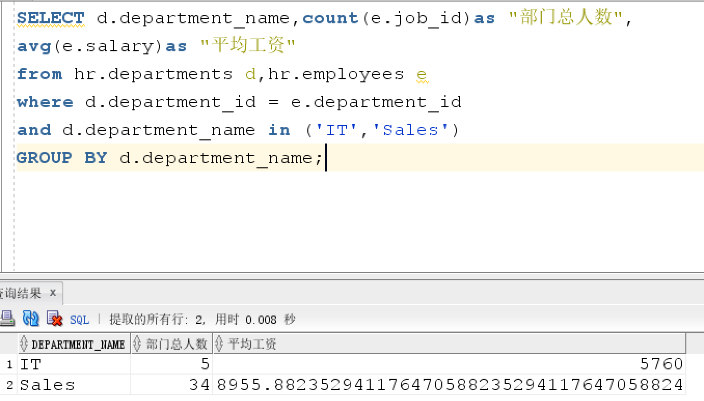
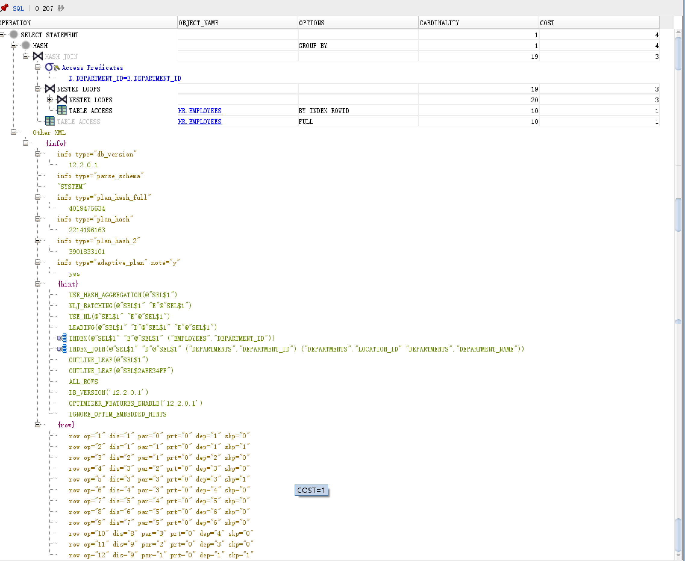
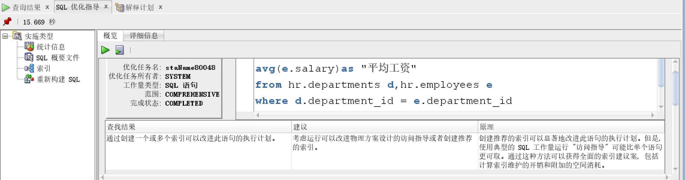
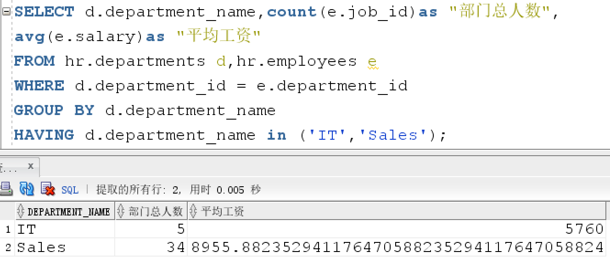
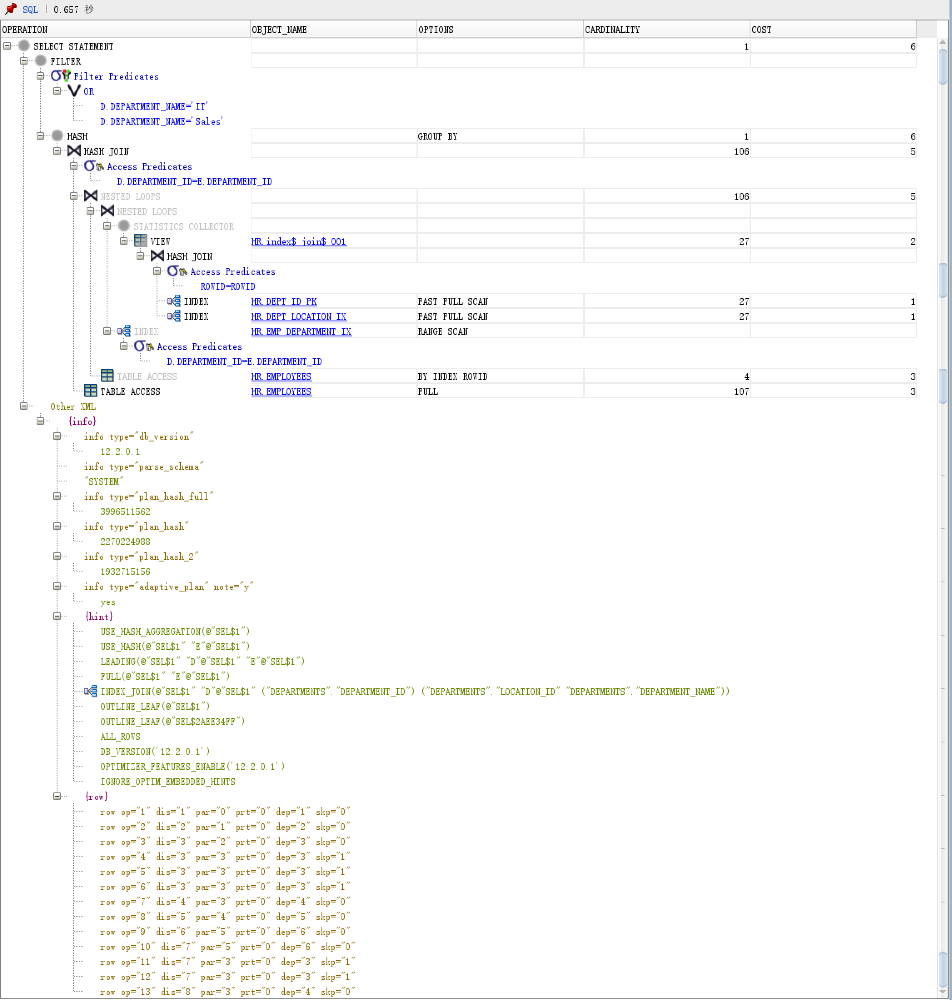
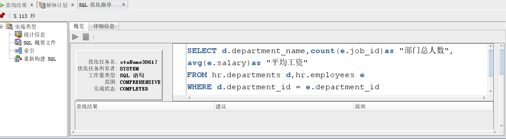
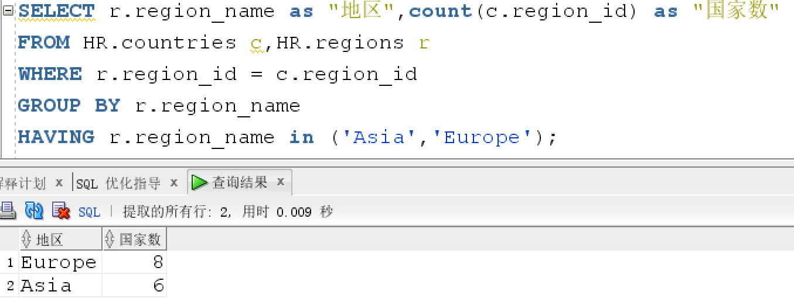
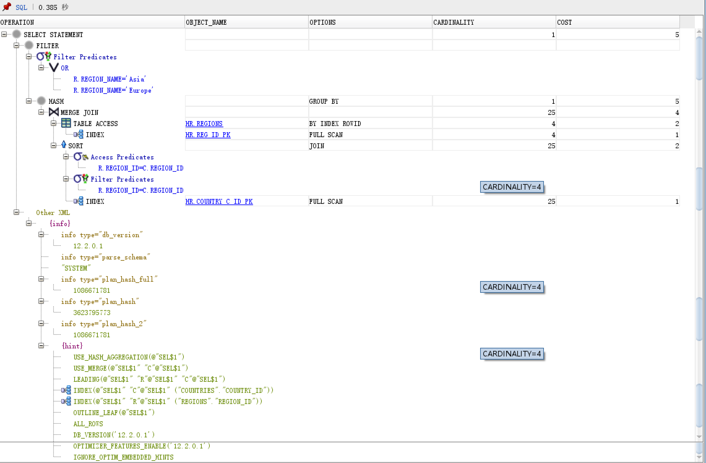
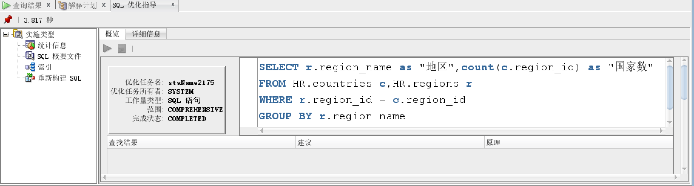

# 实验1：SQL语句的执行计划分析与优化指导

## 软工4班-李仟禧-201810414415

## 实验目的：

  分析SQL执行计划，执行SQL语句的优化指导。理解分析SQL语句的执行计划的重要作用。

## 实验内容：

- 对Oracle12c中的HR人力资源管理系统中的表进行查询与分析。
- 首先运行和分析教材中的样例：本训练任务目的是查询两个部门('IT'和'Sales')的部门总人数和平均工资，以下两个查询的结果是一样的。但效率不相同。
- 设计自己的查询语句，并作相应的分析，查询语句不能太简单。

## 查询语句

查询1：

```SQL
set autotrace on

SELECT d.department_name,count(e.job_id)as "部门总人数",
avg(e.salary)as "平均工资"
from hr.departments d,hr.employees e
where d.department_id = e.department_id
and d.department_name in ('IT','Sales')
GROUP BY d.department_name;
```

查询结果：



解释计划：



SQL优化指导：



- 查询2：

```SQL
set autotrace on

SELECT d.department_name,count(e.job_id)as "部门总人数",
avg(e.salary)as "平均工资"
FROM hr.departments d,hr.employees e
WHERE d.department_id = e.department_id
GROUP BY d.department_name
HAVING d.department_name in ('IT','Sales');
```

查询结果：



解释计划：



SQL优化指导：



第二条语句未给出优化建议

- 查询3（设计自己的查询语句）

```sql
SELECT r.region_name as "地区",count(c.region_id) as "国家数"
FROM HR.countries c,HR.regions r
WHERE r.region_id = c.region_id 
GROUP BY r.region_name
HAVING r.region_name in ('Asia','Europe');
```

查询结果：



解释计划：



SQL优化指导：



优化指导未给出优化建议

## 实验总结

​		对两条SQL语句进行了运行并且比较，发现第一条SQL语句比第二条SQL语句耗时短，并且效率高。原因是第一条SQL语句是先筛选出了结果在进行select出结果，而第二条SQL语句则没有那么灵活，综合比较后，第一条SQL语句是最优的。我自己设计的SQL语句是选择Asia和Europe地区的国家数量，countries表和regions表外键连接后查询结果。